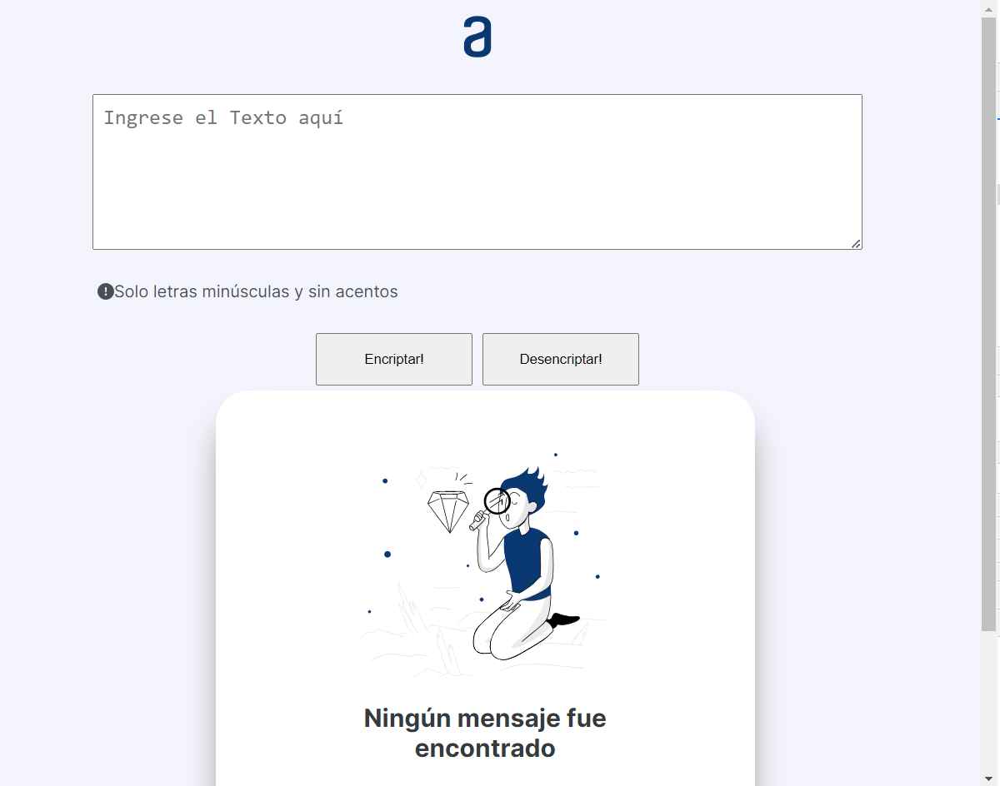
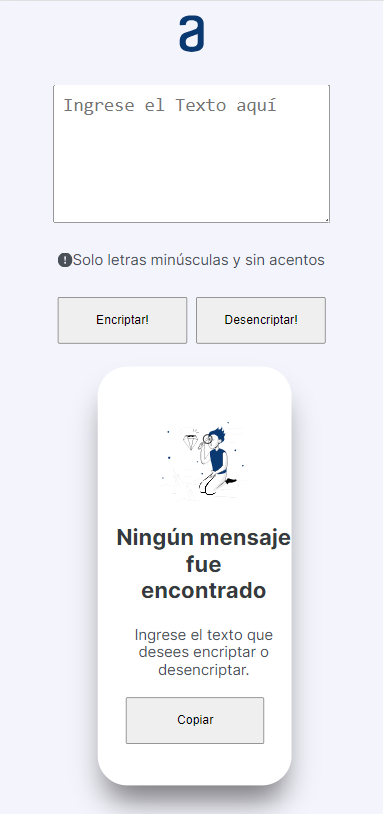

  
# ✔️Encriptador de Texto - Oracle ONE - Alura
  

- El desarrollo de este challenge es parte del proceso formativo como desarrollador en el programa Oracle ONE - Alura. 
  El modelo de desarrollo fue realizado según los parámetros establecidos en el modelo de instrucciones.
  [Trello - Desafío Oracle ONE - Alura](https://trello.com/c/fruTcqMC)

## ➕Características Complementarias

- Con la finalidad de solucionar el desafio se distribuyeron de manera distinta los componentes sugeridos,
  respetando así la esencia de los requerimientos variando ligeramente el estilo:

## ➕Diseño responsive

- En orden de hacer un proyecto dinámico, se realizo el challenge de tal modo que se ajuste a la vista desde diferentes dispositivos.

## ➕Previsualizaciones

### * Vista Desktop

### * Vista Smartphone

## ➕Enlace de la página:

🔗(https://didiersml.github.io/challenge-encriptador/)

## ➕Autor

Este proyecto fue desarrollado por 🔗[Didier Maldonado](https://github.com/DidierSML).

<!-- ## Licencia

Este proyecto está bajo la [Licencia MIT](LICENSE). -->
